# Modélisation d'un composite C/C à partir d'images 2D

**De l'image de microscopie aux propriétés mécaniques effectives :** segmentation par deep learning (U-Net), génération automatique de maillage et solveur éléments finis maison en C++.

Travail d'Étude et de Recherche (ENSEIRB-MATMECA, 2025-2026), réalisé avec le LCTS de Bordeaux sur le composite carbone/carbone de la tuyère du booster d'Ariane 5.

📄 [**Rapport complet (PDF)**](resultats/rapport/TER_COMPOSITE_RAPPORT_GROUPE1.pdf) · 🎞️ [Slides de soutenance](resultats/rapport/diapo.pdf)

<p align="center">
  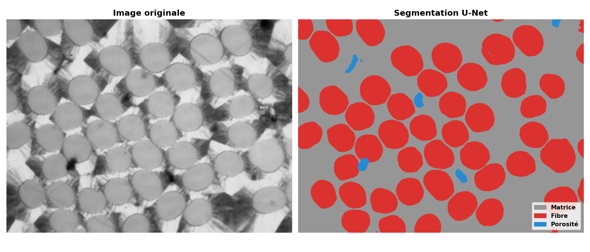
  <br><em>Image de microscopie du composite (gauche) et segmentation U-Net : fibres, matrice, porosités (droite).</em>
</p>

---

## La chaîne numérique

```
 Image microscopie ──► U-Net (PyTorch) ──► Masque 3 classes ──► Maillage Gmsh ──► Solveur EF (C++) ──► E, G, ν effectifs
     (LCTS)             segmentation       fibre/matrice/pore      Q1 / P1          3 chargements        + champs VTK
```

1. **Segmentation** : un U-Net classe chaque pixel de l'image en matrice, fibre ou porosité.
2. **Maillage** : le masque est converti en maillage éléments finis (structuré pixel → quadrangle, ou Delaunay non structuré).
3. **Simulation** : un code éléments finis en élasticité linéaire 2D (contraintes planes) applique trois essais virtuels sur le Volume Élémentaire Représentatif (VER) : traction en x, traction en y, cisaillement.
4. **Homogénéisation** : on en déduit les modules effectifs du composite, comparés aux modèles analytiques (Voigt, Reuss, Hill, Halpin-Tsai).

---

## 1. Segmentation par U-Net

L'approche classique (transformée de Hough) suppose des fibres circulaires de rayon connu. Elle échoue dès que les fibres sont elliptiques ou jointives, et ne détecte pas les porosités. Nous avons donc entraîné un **U-Net** (PyTorch) :

- **17 images annotées** à la main avec Labelme, découpées en patchs 256×256 ;
- **augmentation de données** : rotations, retournements, déformations élastiques, contraste, flou, inversion ;
- **inférence** sur des images de taille quelconque par fenêtre glissante avec vote ;
- **IoU ≈ 0.92** sur la validation, après environ 30 min d'entraînement sur une RTX 4060.

<p align="center">
  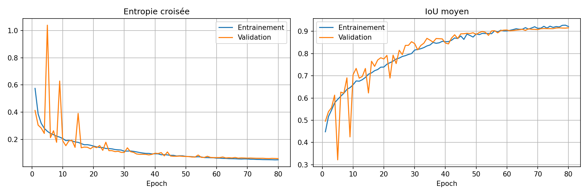
</p>

Le réseau gère aussi les fibres coupées dans le sens longitudinal, ce qui permet d'étudier la direction des fibres :

<p align="center">
  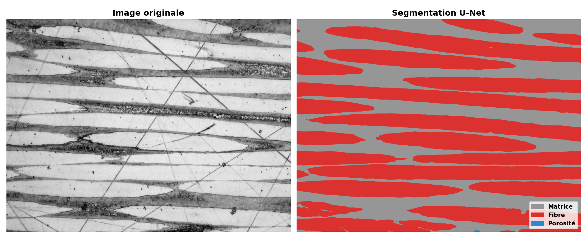
</p>

## 2. Génération du maillage

Chaque pixel du masque (après nettoyage morphologique) devient un élément quadrangle Q1, avec un tag physique par phase. Le paramètre `downscale` règle le compromis entre fidélité géométrique et coût de calcul. Un mailleur Delaunay non structuré (extraction de contours + Gmsh/OCC) est aussi disponible.

<p align="center">
  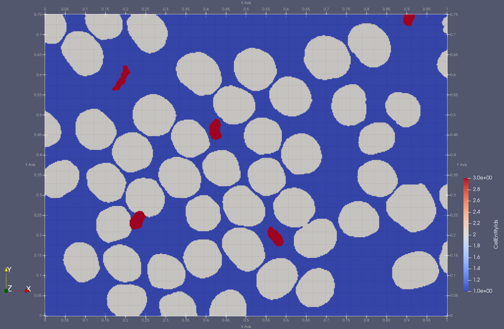
  
  <br><em>Même VER maillé avec un downscale de 5 (125 000 éléments) et de 15 (14 000 éléments). Matrice en bleu, fibres en gris, porosités en rouge.</em>
</p>

## 3. Solveur éléments finis (C++)

Code écrit de zéro en C++17, avec Eigen pour l'algèbre creuse et OpenMP pour le parallélisme :

- éléments **P1** (triangles) et **Q1** (quadrangles, intégration de Gauss 2×2) ;
- lecture des maillages Gmsh 2.2, matériaux multiphases (fibre / matrice / pore) ;
- conditions de Dirichlet et de Neumann (forces réparties uniformes, gaussiennes, linéaires) ;
- **gradient conjugué préconditionné** (Cholesky incomplet) ;
- calcul des déformations, contraintes et énergies, export **VTK** (ParaView) et CSV ;
- paramétrage complet par fichier texte, sans recompilation.

**Validation** sur trois cas tests analytiques (traction, flexion d'Euler-Bernoulli, cisaillement pur) : l'erreur sur l'énergie de déformation converge à l'**ordre 2**, comme le prévoit la théorie.

<p align="center">
  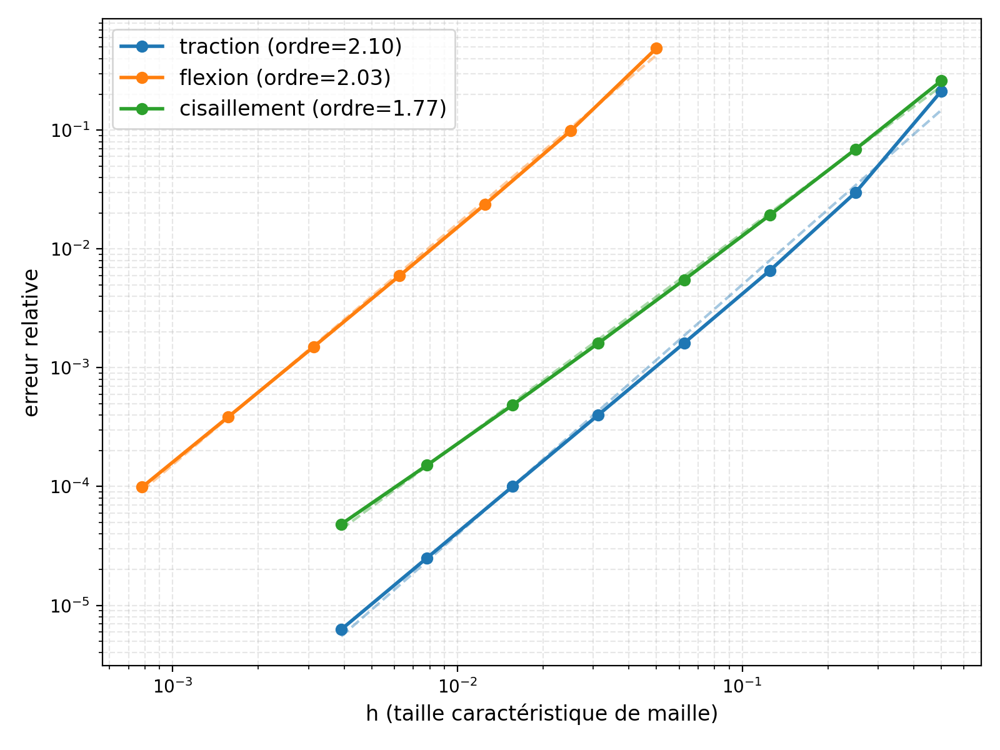
</p>

---

## Résultats principaux

### Champs mécaniques dans le plan transverse

Dans le composite, les fibres sont rigides et la matrice plus souple. Les contraintes et les déformations se concentrent donc dans les ponts de matrice entre fibres voisines : ce sont les zones où l'endommagement devrait apparaître en premier.

<p align="center">
  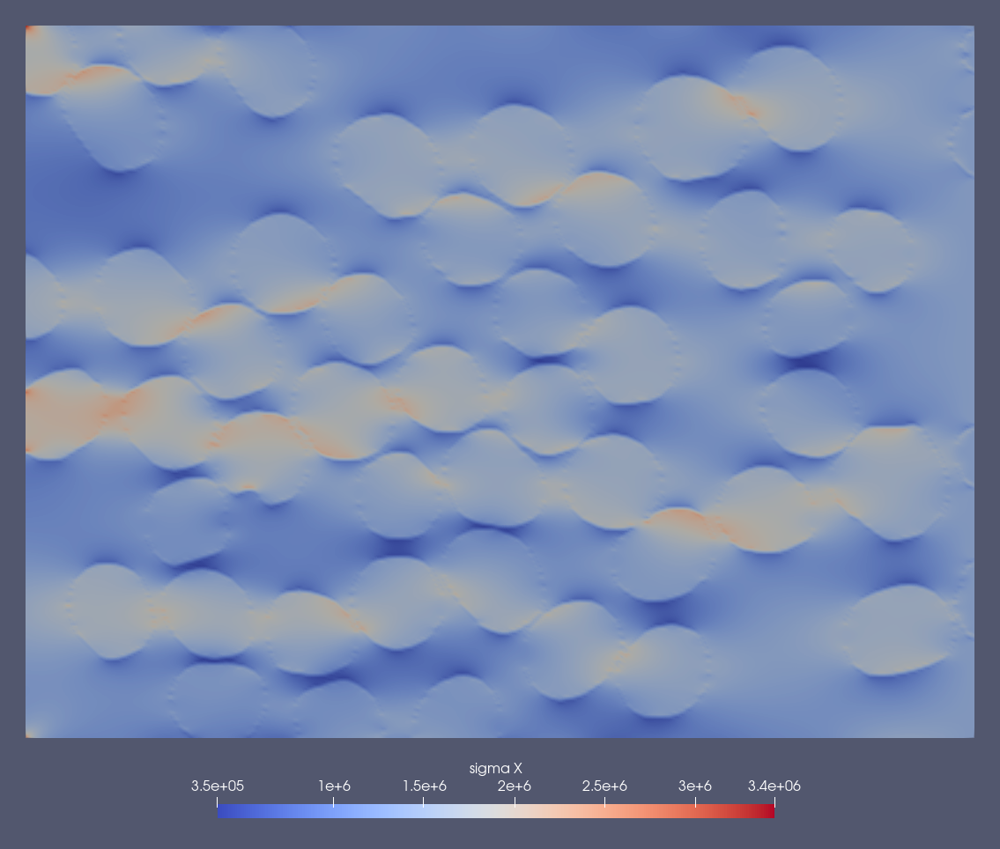
  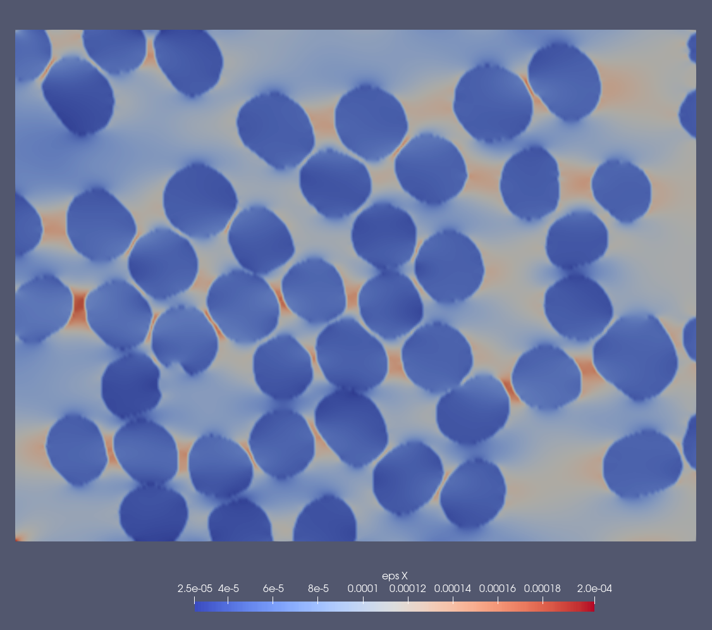
  <br><em>Traction selon x : contrainte σ<sub>xx</sub> (gauche) et déformation ε<sub>xx</sub> (droite), qui varie d'un facteur 8 entre fibre et matrice.</em>
</p>

### Propriétés effectives et modèles analytiques

Pour un VER avec V<sub>f</sub> ≈ 0.45 (fibre : 34 GPa, matrice : 12 GPa) :

| | Éléments finis | Voigt | Reuss | Hill | Halpin-Tsai |
|---|:---:|:---:|:---:|:---:|:---:|
| E<sub>T</sub> (GPa) | **18.10** | 21.90 | 16.93 | 19.41 | 18.34 |
| G<sub>LT</sub> (GPa) | **7.19** | 8.66 | 6.57 | 7.61 | 7.15 |

- Le composite est bien **isotrope dans le plan transverse** (E<sub>11</sub> ≈ E<sub>22</sub>), et le tenseur de souplesse est symétrique à 0.03 % près.
- Le résultat est convergé en maillage à partir d'environ 125 000 éléments (≈ 20 s de calcul).

En répétant le calcul sur **9 VER** tirés des images (V<sub>f</sub> de 0.25 à 0.57), le modèle d'**Halpin-Tsai recalé** reproduit les résultats numériques avec une erreur relative moyenne de **0.4 %**, contre 6 à 8 % pour Reuss et Hill et 16 % pour Voigt.

<p align="center">
  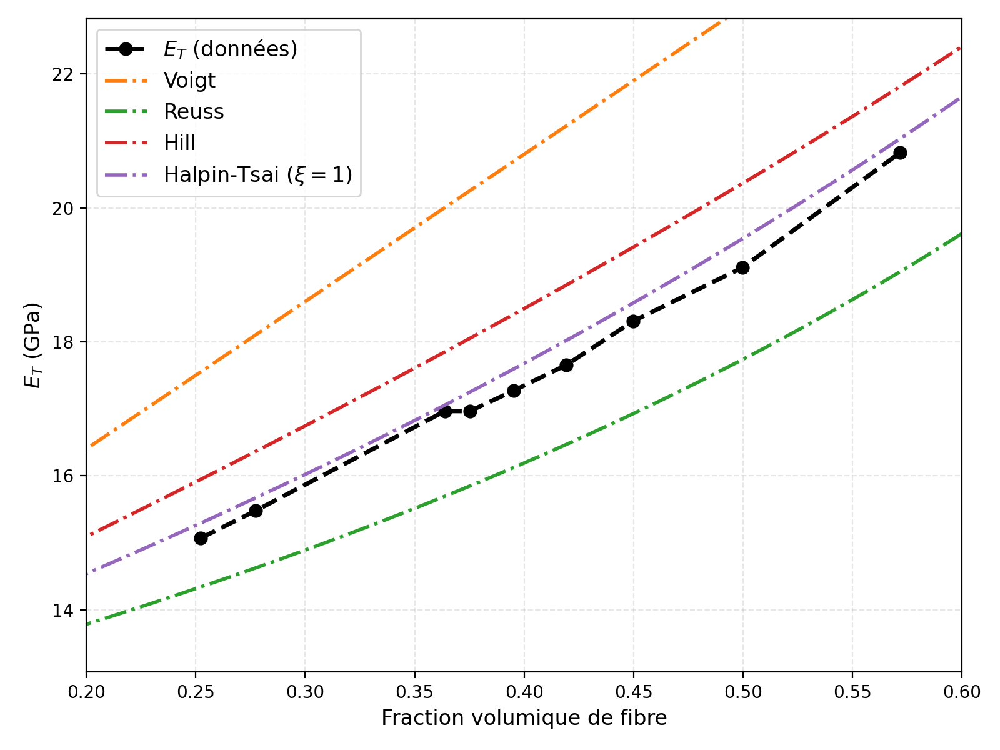
  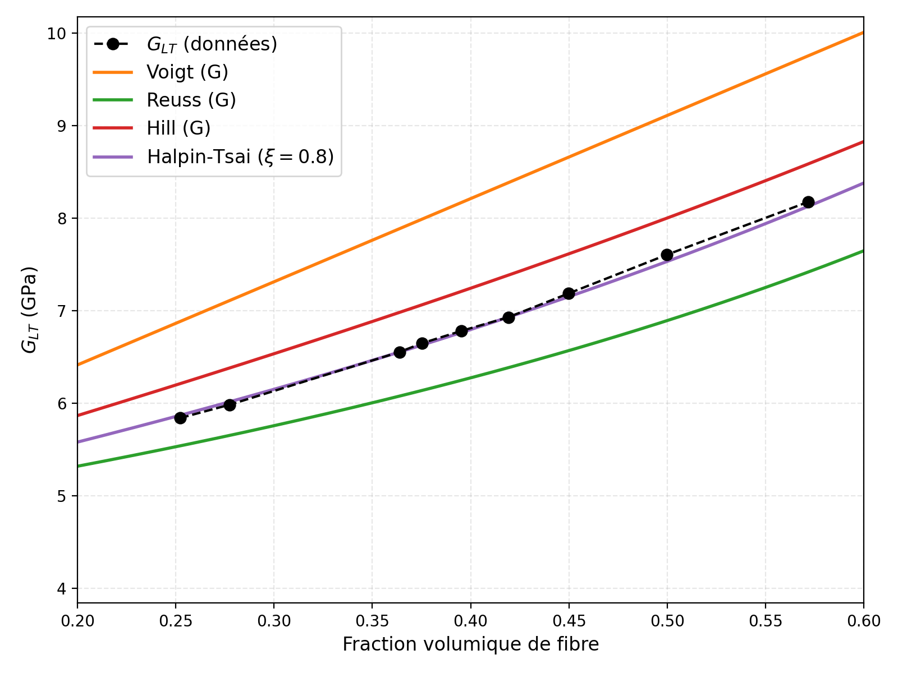
</p>

### Influence des porosités

Les porosités sont modélisées comme une troisième phase très souple. Sur un même VER, elles font perdre **7 à 10 %** de rigidité, rendent le matériau anisotrope et créent des **concentrations de contraintes jusqu'à ×6** autour des défauts, cohérentes avec la solution de Kirsch.

<p align="center">
  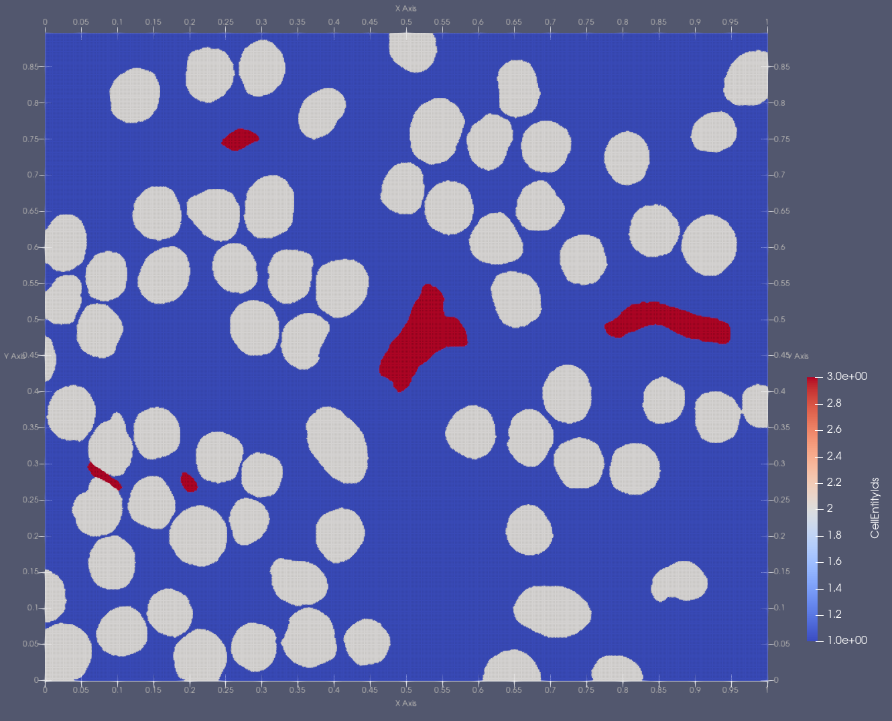
  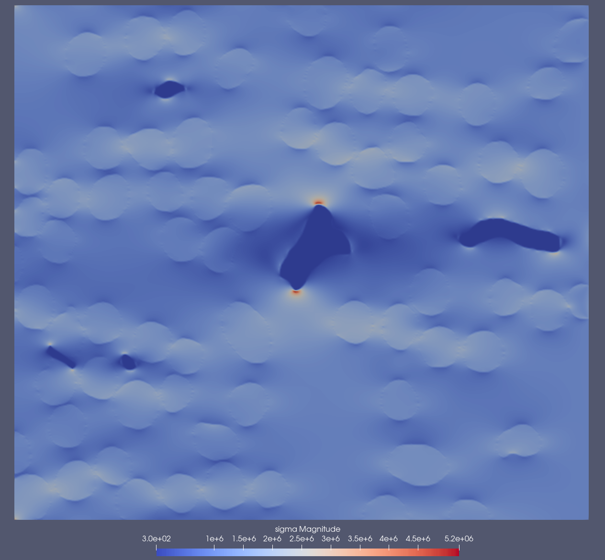
</p>

### Direction longitudinale

Sur une image où les fibres sont coupées dans leur longueur (fibre PANEX 33 : 228 GPa, V<sub>f</sub> ≈ 0.6), on obtient **E<sub>L</sub> ≈ 146 GPa**, proche de la borne de Voigt et très bien décrit par Halpin-Tsai (ξ = 8). Dans ce cas, ce sont les fibres qui portent la charge : la contrainte y est environ 10 fois plus élevée que dans la matrice.

---

## Organisation du dépôt

```
IBM/                     Traitement d'image (Python)
├── segmentation.py      U-Net : architecture, dataset, entraînement, inférence
├── mesh.py              Masque → maillage structuré Q1 / triangles
├── mesh_Delauney.py     Masque → maillage Delaunay non structuré (Gmsh)
├── main.py              Pipeline complet image → segmentation → .msh
├── unet_weights.pth     Poids du U-Net entraîné
├── images/, labels/     Images de microscopie et annotations Labelme
└── dataset/             Paires image / masque pour l'entraînement

FEM/                     Solveur éléments finis (C++)
├── src/                 Mesh, Element (P1/Q1), Material, Solver, cas tests
├── config/              Fichiers de configuration des simulations
├── mesh/                Maillages de validation et des VER composites
└── geo/                 Géométries Gmsh et script de génération des maillages de validation

resultats/               Résultats (CSV), post-traitement et rapport
├── postprocess.py       Courbes de convergence et étude de fraction volumique
└── rapport/             Rapport LaTeX, slides et figures
meshes/                  Maillages exportés et script de rendu ParaView
```

## Utilisation

### Segmentation et maillage (Python)

```bash
cd IBM
pip install torch torchvision numpy scipy scikit-image opencv-python pillow matplotlib
# (optionnel, pour le mailleur Delaunay) pip install gmsh

# Pipeline complet : segmente l'image avec les poids fournis puis génère le maillage
python main.py images/1_0.03um.png --mesh-type quad --resolution 5
# → results/1_segmented.png, results/1_seg.npy, results/composite1_vf<Vf>_q1.msh

# Variante Delaunay avec raffinement aux interfaces
python main.py images/1_0.03um.png --mesh-type delaunay --refine

# Segmentation seule
python segmentation.py predict images/1_0.03um.png

# Ré-entraîner le U-Net sur dataset/ (GPU recommandé)
python segmentation.py
```

### Simulation éléments finis (C++)

Il faut CMake, un compilateur C++17 et Eigen3 (`sudo apt install libeigen3-dev`). OpenMP est optionnel.

```bash
cd FEM
cmake -B build && cmake --build build -j
mkdir -p results

./build/run config/composite.txt        # homogénéisation d'un VER (plan transverse)
./build/run config/composite_longi.txt  # direction longitudinale
./build/run config/traction.txt         # validation : traction, flexion, shear
```

Exemple de fichier de configuration :

```ini
test_type = composite       # composite | traction | flexion | shear
element_type = Q1           # Q1 | P1
mesh_file = mesh/composite_convergence/composite1_vf0.452_5.msh

# Matrice
E = 12e9
nu = 0.3
# Fibre
E_fiber = 34e9
nu_fiber = 0.25
# Porosités (décommenter pour les activer)
#E_pore = 1e7
#nu_pore = 0.3

F = 1e6                     # force appliquée (N)
precond = ic                # ic (Cholesky incomplet) | diag
tol = 1e-6
maxIter = 4000
```

Le solveur affiche les propriétés effectives (E<sub>11</sub>, E<sub>22</sub>, ν<sub>12</sub>, ν<sub>21</sub>, G<sub>12</sub>) avec les bornes analytiques. Il écrit dans `results/` les champs de chaque essai (`.vtk`, à ouvrir dans ParaView) et un récapitulatif des propriétés (`.csv`).

### Post-traitement

```bash
cd resultats
python postprocess.py   # courbes de convergence, étude de Vf, comparaison aux modèles analytiques
```

---

## Limites et perspectives

- Les phases sont supposées isotropes dans le plan. Les fibres de carbone sont en réalité très anisotropes, et les résultats longitudinaux restent donc une première estimation.
- Le maillage structuré en pixels rend les interfaces en marches d'escalier. Le mailleur Delaunay est une piste pour y remédier.
- Suites possibles : lois de comportement anisotropes, endommagement et rupture autour des porosités, couplage thermomécanique, passage à la tomographie 3D.

## Auteurs

Julien Léger, Anass Aboufadel, Simon Frangeo, Iñaki Arrossagaray, Jacques Nithart

Encadrants : Olivier Caty (LCTS) et Kévin Santugini (IMB)
